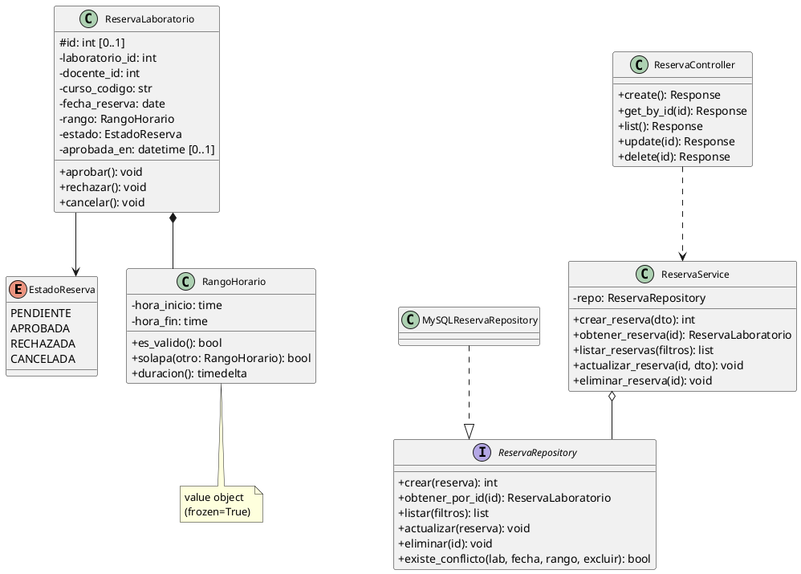
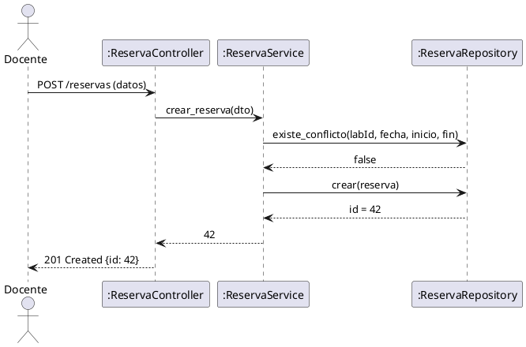
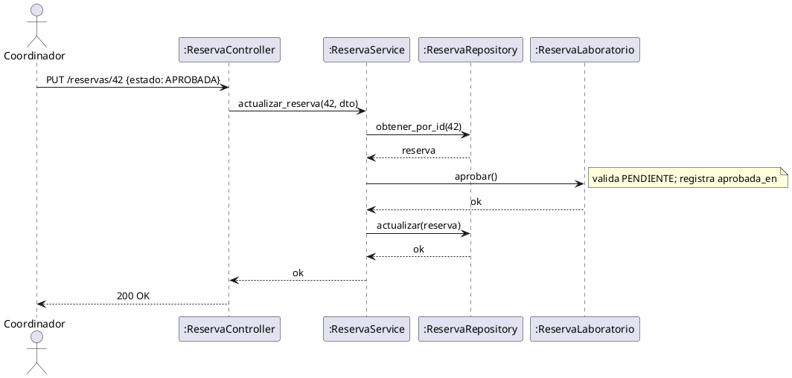

# Caso de Estudio POO: Sistema de Reservas de Laboratorio

**Asignatura:** Programación Orientada a Objetos
**Nivel:** Intermedio — Arquitectura en capas con Flask y MySQL
**Entregable:** Análisis, modelado UML y diseño del sistema

---

## Objetivo

Desarrollar un sistema de gestión de reservas de laboratorios universitarios aplicando los principios y técnicas de Programación Orientada a Objetos (POO), desde el enunciado del problema hasta el diseño completo con UML, como base para una implementación con API REST en Flask y MySQL sin ORM.

---

## 1. Enunciado del Problema

### 1.1 Contexto

La UNEMI gestiona reservas de laboratorios de cómputo de forma manual (formulario físico + hoja de cálculo), lo que genera conflictos de horario, falta de trazabilidad y respuestas lentas. Se requiere una **API REST** que centralice la gestión y aplique las reglas de negocio automáticamente.

---

### 1.2 Reglas de Negocio

El sistema debe garantizar las siguientes reglas (**invariantes del dominio**):

**Reglas sobre el tiempo:**
- Una reserva no puede realizarse para una fecha anterior al día actual. El pasado no puede reservarse.
- El bloque horario debe ser válido: la hora de inicio debe ser estrictamente menor que la hora de fin. No se permiten bloques de duración cero ni negativos.
- El bloque mínimo de reserva es de 1 hora. El bloque máximo es de 4 horas consecutivas por reserva.

**Reglas sobre disponibilidad:**
- No puede existir más de una reserva activa (no cancelada, no rechazada) para el mismo laboratorio, en la misma fecha y en un bloque horario que se solape con otro ya existente. Dos bloques se solapan si uno comienza antes de que el otro termine.
- Al crear o modificar una reserva, el sistema debe verificar automáticamente la disponibilidad antes de confirmar la operación.

**Reglas sobre el ciclo de vida:**
- Toda reserva inicia en estado `PENDIENTE` al ser creada por el docente.
- Solo el coordinador puede cambiar el estado a `APROBADA` o `RECHAZADA`.
- El docente puede cancelar su propia reserva, siempre que aún esté en estado `PENDIENTE`.
- Una reserva `APROBADA` solo puede pasar a `CANCELADA`, no puede volver a `PENDIENTE` ni a `RECHAZADA`.
- Cuando una reserva es `APROBADA`, el sistema debe registrar automáticamente la fecha y hora exacta en que ocurrió la aprobación.

**Reglas sobre persistencia:**
- Los registros nunca se eliminan físicamente de la base de datos. El borrado es **lógico**: se marca una fecha de eliminación, pero el registro se mantiene para auditoría.
- Toda reserva debe tener registrada su fecha de creación y su fecha de última modificación.

---

### 1.3 Actores del Sistema

| Actor        | Descripción                                                                                       |
|--------------|---------------------------------------------------------------------------------------------------|
| **Docente**  | Solicita reservas de laboratorio para sus clases. Puede cancelar sus propias reservas pendientes. |
| **Coordinador** | Revisa las solicitudes pendientes. Puede aprobar o rechazar reservas. Consulta el historial. |
| **Sistema**  | Actor técnico. Valida reglas de negocio, detecta conflictos y gestiona el ciclo de vida automáticamente. |

---

### 1.4 Escenarios de Uso

**Escenario 1 — Reserva exitosa:**
La docente Ana García necesita el Laboratorio A el martes 10 de junio de 2026 de 08:00 a 10:00 para dictar la clase práctica de INF-202. Ingresa la solicitud al sistema. El sistema verifica que la fecha no es pasada, que el bloque es válido y que no existe ninguna reserva activa en ese laboratorio para ese horario. La solicitud se crea en estado `PENDIENTE`. El coordinador revisa y la aprueba; el sistema registra la aprobación con fecha y hora exactas. La reserva queda en estado `APROBADA`.

**Escenario 2 — Conflicto de horario:**
El docente Luis Romero intenta reservar el mismo Laboratorio A para el 10 de junio de 2026 de 09:00 a 11:00. El sistema detecta que ese bloque se solapa con la reserva ya existente de Ana García (08:00–10:00), ya que 09:00 < 10:00 y 11:00 > 08:00. El sistema rechaza la operación con un mensaje claro de conflicto. Luis debe elegir otro laboratorio u otro horario.

---

---

## 2. Análisis de Requerimientos

### 2.1 Requerimientos Funcionales

| ID    | Descripción                                                         |
|-------|---------------------------------------------------------------------|
| RF-01 | Crear una reserva de laboratorio                                    |
| RF-02 | Obtener una reserva por identificador                               |
| RF-03 | Listar reservas con filtros (estado, fecha, laboratorio)            |
| RF-04 | Actualizar reserva (datos, bloque horario, estado)                  |
| RF-05 | Eliminar reserva mediante borrado lógico                            |
| RF-06 | Validar conflictos de horario antes de crear o actualizar           |

### 2.2 Requerimientos No Funcionales

| ID     | Descripción                                         |
|--------|-----------------------------------------------------|
| RNF-01 | API REST con respuestas en formato JSON             |
| RNF-02 | Arquitectura en capas (dominio, aplicación, infra)  |
| RNF-03 | Sin ORM — SQL parametrizado con mysqlclient          |
| RNF-04 | Pool de conexiones MySQL                            |
| RNF-05 | Manejo de errores consistente y centralizado        |

### 2.3 Casos de Uso Principales

| CU    | Nombre                          | Actor       |
|-------|---------------------------------|-------------|
| CU-01 | Registrar reserva               | Docente     |
| CU-02 | Aprobar reserva                 | Coordinador |
| CU-03 | Consultar reservas por estado   | Coordinador |
| CU-04 | Cancelar reserva                | Docente     |

---

## 3. Proceso de Abstracción y Análisis

> **Clave de abstracción:** Si un concepto del enunciado tiene **datos propios** y **comportamiento propio**, es candidato a clase. Los sustantivos → clases o atributos; los verbos → métodos.

---

### 3.1 Identificación de Conceptos del Dominio

| Concepto                         | Tipo                    | Capa arquitectónica | Responsabilidad principal                                   |
|----------------------------------|-------------------------|---------------------|-------------------------------------------------------------|
| `EstadoReserva`                  | Enumeración             | Dominio             | Define los valores válidos del ciclo de vida                |
| `RangoHorario`                   | Objeto de valor         | Dominio             | Encapsula y valida el bloque horario; inmutable             |
| `ReservaLaboratorio`             | Entidad de dominio      | Dominio             | Concentra datos y reglas de negocio de una reserva          |
| `ReservaRepository`              | Interfaz (contrato)     | Dominio             | Desacopla dominio de la tecnología de persistencia          |
| `ReservaService`                 | Servicio de aplicación  | Aplicación          | Orquesta los casos de uso del sistema                       |
| `ReservaDAO`                     | Objeto de acceso a datos| Infraestructura     | Centraliza la ejecución de SQL y el mapeo de resultados     |
| `ConnectionPool`                 | Componente de infra     | Infraestructura     | Gestiona y reutiliza conexiones a MySQL                     |
| `MySQLReservaRepository`         | Implementación          | Infraestructura     | Implementa `ReservaRepository` usando `ReservaDAO`          |
| `ReservaController`              | Controlador REST        | API / Interfaz      | Traduce peticiones HTTP en llamadas al servicio             |

---

### 3.2 Análisis por Clase: Atributos y Métodos

A partir de los conceptos identificados, se definen los atributos y métodos de cada clase. Este análisis es la base directa del diagrama UML.

---

#### `EstadoReserva` — Enumeración

| Valor        | Significado                                                       |
|--------------|-------------------------------------------------------------------|
| `PENDIENTE`  | Creada; en espera de revisión del coordinador                     |
| `APROBADA`   | Aprobada; laboratorio asignado                                    |
| `RECHAZADA`  | Denegada; bloque horario libre                                    |
| `CANCELADA`  | Cancelada voluntariamente; registro conservado                    |

**Transiciones permitidas:**

```
PENDIENTE ──aprobar()──► APROBADA ──cancelar()──► CANCELADA
PENDIENTE ──rechazar()─► RECHAZADA
PENDIENTE ──cancelar()─► CANCELADA
```

---

#### `RangoHorario` — Objeto de Valor (inmutable)

| Atributo      | Tipo   | Descripción                            |
|---------------|--------|----------------------------------------|
| `hora_inicio` | `time` | Inicio del bloque (formato `HH:MM:SS`) |
| `hora_fin`    | `time` | Fin del bloque (formato `HH:MM:SS`)    |

| Método          | Retorno     | Descripción                                    |
|-----------------|-------------|------------------------------------------------|
| `es_valido()`   | `bool`      | `True` si `hora_inicio < hora_fin`             |
| `solapa(otro)`  | `bool`      | `True` si se superpone con otro `RangoHorario` |
| `duracion()`    | `timedelta` | Duración del bloque horario (fin − inicio)     |

---

#### `ReservaLaboratorio` — Entidad Principal

| Atributo         | Tipo               | Descripción                                  |
|------------------|--------------------|----------------------------------------------|
| `id`             | `int \| None`      | Asignado por la BD al persistir              |
| `laboratorio_id` | `int`              | Laboratorio reservado                        |
| `docente_id`     | `int`              | Docente solicitante                          |
| `curso_codigo`   | `str`              | Código del curso (ej: `INF-202`)             |
| `fecha_reserva`  | `date`             | Fecha de uso                                 |
| `rango`          | `RangoHorario`     | Bloque horario (composición)                 |
| `estado`         | `EstadoReserva`    | Ciclo de vida; inicia siempre en `PENDIENTE` |
| `aprobada_en`    | `datetime \| None` | Registrado automáticamente al aprobar        |

| Método       | Precondición                     | Efecto                                      |
|--------------|----------------------------------|---------------------------------------------|
| `aprobar()`  | `estado == PENDIENTE`            | `estado = APROBADA`; registra `aprobada_en` |
| `rechazar()` | `estado == PENDIENTE`            | `estado = RECHAZADA`                        |
| `cancelar()` | `estado ∈ {PENDIENTE, APROBADA}` | `estado = CANCELADA`                        |

> El atributo `estado` **nunca** se asigna directamente. Solo cambia a través de estos métodos (encapsulamiento).

---

#### `ReservaRepository` — Interfaz (contrato de persistencia)

| Método                | Retorno                      | Descripción                                       |
|-----------------------|------------------------------|---------------------------------------------------|
| `crear(reserva)`      | `int`                        | Persiste y retorna el ID generado                 |
| `obtener_por_id(id)`  | `ReservaLaboratorio \| None` | Busca por ID activo                               |
| `listar(filtros)`     | `List`                       | Lista activas con filtros opcionales              |
| `actualizar(reserva)` | `void`                       | Persiste cambios sobre una reserva existente      |
| `eliminar(id)`        | `void`                       | Borrado lógico                                    |
| `existe_conflicto(…)` | `bool`                       | Detecta solapamiento de bloques horarios          |

---

#### `ReservaService` — Servicio de Aplicación

| Atributo | Tipo                | Descripción                                 |
|----------|---------------------|---------------------------------------------|
| `repo`   | `ReservaRepository` | Inyectado; no depende de MySQL directamente |

| Método                        | Descripción                                              |
|-------------------------------|----------------------------------------------------------|
| `crear_reserva(dto)`          | Valida rango, duración, fecha y conflicto; crea entidad y persiste |
| `obtener_reserva(id)`         | Retorna reserva o lanza `DomainError`                    |
| `listar_reservas(filtros)`    | Delega al repositorio                                    |
| `actualizar_reserva(id, dto)` | Valida rango, duración, fecha y conflicto; aplica transición de estado |
| `eliminar_reserva(id)`        | Verifica existencia y delega borrado lógico              |

---

#### `ReservaController` — Controlador REST

| Método HTTP | Ruta                    | Servicio llamado       | Código    |
|-------------|-------------------------|------------------------|-----------|
| `POST`      | `/api/v1/reservas`      | `crear_reserva`        | 201 / 400 |
| `GET`       | `/api/v1/reservas`      | `listar_reservas`      | 200       |
| `GET`       | `/api/v1/reservas/{id}` | `obtener_reserva`      | 200 / 404 |
| `PUT`       | `/api/v1/reservas/{id}` | `actualizar_reserva`   | 200 / 400 |
| `DELETE`    | `/api/v1/reservas/{id}` | `eliminar_reserva`     | 200 / 404 |

---

### 3.3 Aplicación de Técnicas POO

| # | Técnica              | Cómo se aplica en este sistema                                                                                  |
|---|----------------------|-----------------------------------------------------------------------------------------------------------------|
| 1 | **Encapsulamiento**  | `ReservaLaboratorio` controla sus transiciones de estado mediante métodos (`aprobar()`, `rechazar()`, `cancelar()`). El atributo `estado` no se modifica directamente desde fuera. |
| 2 | **Abstracción**      | `ReservaRepository` es una interfaz abstracta. El servicio no sabe si la persistencia usa MySQL, PostgreSQL o memoria. |
| 3 | **Herencia**         | No se usa herencia de clase concreta para auditoría. `id` es atributo directo de `ReservaLaboratorio`. Los campos `created_at` / `updated_at` son gestionados por MySQL (`DEFAULT CURRENT_TIMESTAMP`) y no forman parte del modelo de dominio. |
| 4 | **Polimorfismo**     | Cualquier implementación de `ReservaRepository` puede reemplazar a `MySQLReservaRepository` sin cambiar el servicio. En pruebas se usa un repositorio en memoria. |
| 5 | **Composición**      | `ReservaLaboratorio` compone `RangoHorario`. El rango no tiene identidad ni sentido fuera de la reserva que lo contiene. |
| 6 | **Agregación**       | `ReservaService` agrega `ReservaRepository` por inyección de dependencias. El servicio no crea sus dependencias; las recibe. La validación de conflictos se delega al repositorio mediante `existe_conflicto()`. |
| 7 | **Asociación**       | `ReservaLaboratorio` se asocia con `Laboratorio` y `Docente` a través de identificadores (FK conceptual), sin composición directa. |
| 8 | **Dependencia**      | `ReservaController` depende de `ReservaService`; `ReservaService` depende de `ReservaRepository`. Ninguna capa salta niveles. |

---

### 3.4 Invariantes de Dominio

Las invariantes son condiciones que el sistema debe garantizar **siempre**, independientemente del camino de ejecución. Si alguna se viola, se lanza `DomainError`.

| Invariante                                                        | Cuándo se verifica       | Quién la verifica           |
|-------------------------------------------------------------------|--------------------------|-----------------------------|
| `fecha_reserva >= fecha actual`                                   | Al crear / actualizar    | `ReservaService`            |
| `hora_inicio < hora_fin`                                          | Siempre                  | `RangoHorario.es_valido()`  |
| `1 hora ≤ duración ≤ 4 horas`                                     | Al crear / actualizar    | `ReservaService`            |
| `estado ∈ {PENDIENTE, APROBADA, RECHAZADA, CANCELADA}`            | Siempre                  | `EstadoReserva` (enum)      |
| Si `estado = APROBADA` → `aprobada_en ≠ None`                     | Al aprobar               | `ReservaLaboratorio.aprobar()` |
| No existe reserva activa con mismo lab, fecha y bloque solapado   | Al crear / actualizar    | `ReservaService` (vía `repo.existe_conflicto()`) |
| Una reserva `RECHAZADA` o `CANCELADA` no puede volver a `PENDIENTE` | En toda transición     | `ReservaLaboratorio` (métodos) |

---

## 4. Relaciones entre Entidades (POO)

| Relación             | Clases involucradas                                         | Descripción                                                           |
|----------------------|-------------------------------------------------------------|-----------------------------------------------------------------------|
| Composición          | `ReservaLaboratorio` ◆── `RangoHorario`                     | El rango horario no existe sin la reserva                            |
| Implementación       | `ReservaRepository` ◁── `MySQLReservaRepository`            | El repositorio MySQL implementa el contrato de la interfaz            |
| Asociación           | `MySQLReservaRepository` ──► `ReservaDAO`                   | El repositorio usa el DAO para ejecutar SQL                           |
| Asociación           | `ReservaDAO` ──► `ConnectionPool`                           | El DAO obtiene conexiones del pool                                    |
| Agregación           | `ReservaService` ◇── `ReservaRepository`                   | El servicio usa el repositorio, pero no lo posee                      |
| Dependencia          | `ReservaController` ──► `ReservaService`                    | El controlador usa el servicio solo para delegar peticiones           |

---

## 5. Modelado UML de Clases

### 5.1 Diagrama de Clases



### 5.2 Lectura Didáctica del Diagrama

| Observación                              | Principio POO              |
|------------------------------------------|----------------------------|
| `ReservaLaboratorio` concentra reglas    | Encapsulamiento            |
| `ReservaRepository` es interfaz          | Abstracción / Polimorfismo |
| `RangoHorario` es inmutable              | Objeto de valor            |
| `ReservaService` recibe dependencias     | Inyección de dependencias  |
| `ReservaController` no toca el DAO       | Separación de capas        |

---

## 6. Modelado UML de Secuencia

### 6.1 Secuencia: Crear Reserva



### 6.2 Secuencia: Aprobar Reserva



---

## 7. Checklist de Aprendizaje

- [ ] Identificar las entidades, objetos de valor y servicios de dominio del sistema.
- [ ] Diferenciar composición, agregación, asociación y dependencia en el diagrama.
- [ ] Explicar por qué se usa una interfaz de repositorio y qué ventaja aporta.
- [ ] Justificar la elección de SQL parametrizado en lugar de un ORM.
- [ ] Describir qué invariante del dominio impide crear reservas en el pasado.
- [ ] Proponer una regla de negocio adicional (ejemplo: máximo 4 horas por docente por día).
